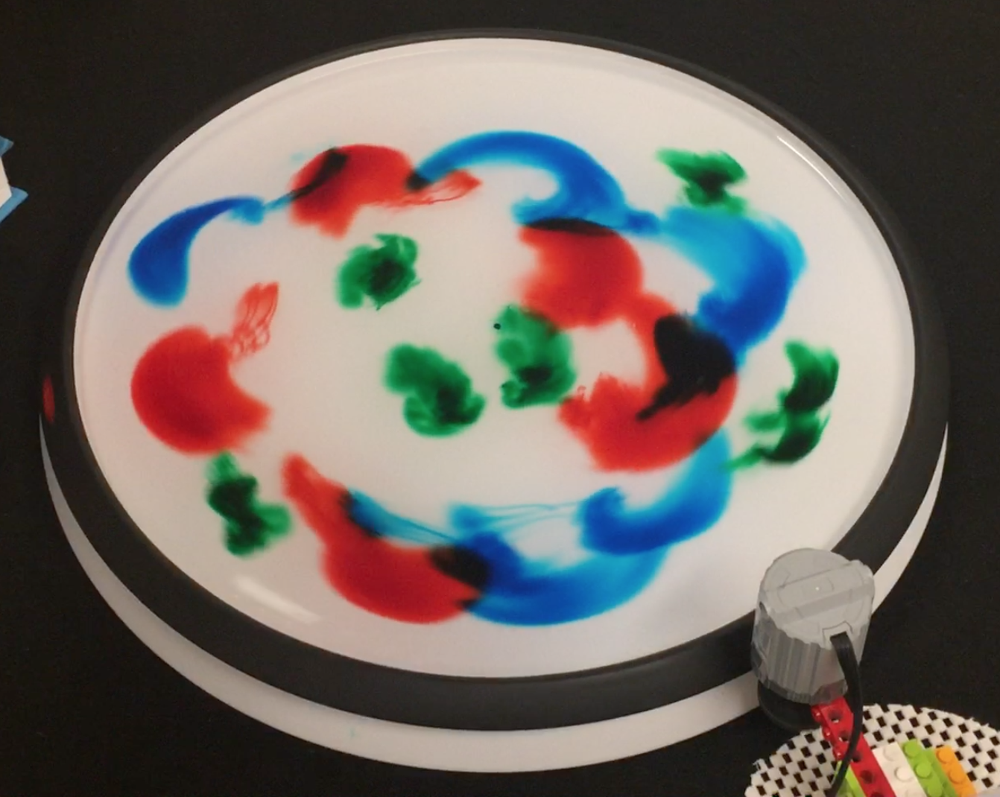

The DIY Rotating Table outreach project is designed to introduce classrooms of all ages to geophysical fluid dynamics (GFD) concepts. GFD can be broken down into

- “Geo”: Earth  
- “Physical”: physics  
- “Fluid”: liquids and gases  
- “Dynamics”: how things move around

so that overall GFD = the physics of fluid motions on Earth and other planets.

A significant component of research on GFD involves the use of rotating tanks to model the behavior of larger systems. To this end, we seek to provide a cheap and effective means for anyone interested to procure their own rotating tanks. We have developed a design using commerically available LEGO parts and a lazy susan that has the ability to model GFD as well as more expensive systems. The "Instructions" page of this website describes how you can procure and operate your own DIY Rotating Table.

Another aspect of the DIY Rotating Table outreach project is to visit classrooms and provide interactive GFD demonstrations. We have visited several schools in the Los Angeles area and taught students about the use of models in scientific research. In the context of GFD, we showed how our assortment of rotating tanks (from our large "White Whale" to our smaller DIY Rotating Tables) can be used to observe various aspects of GFD. We included the students in all of these demonstrations and motivated them to think critically about how their observations related to the real world. The DIY Rotating Table was a key tool in providing everyone the opportunity to learn about GFD. The "Posts" section of this website includes more detail on our outreach events.

Ultimately, we hope that our efforts can expand the study of GFD to classrooms across the country. The "Resources" page of this website includes a write up of our lab that can be used to familiarize both educators and students with GFD concepts. With the DIY Rotating Table, individuals can perform these demonstrations and many more by themselves.

We hope you have fun learning about GFD and this outreach project!
