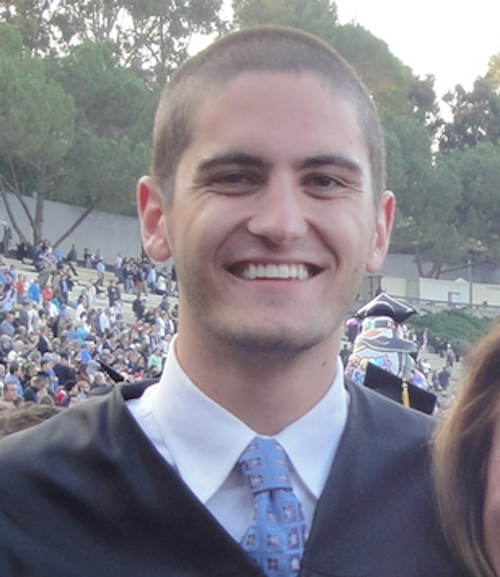
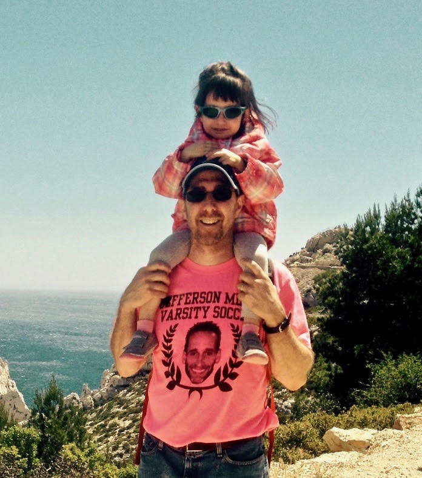
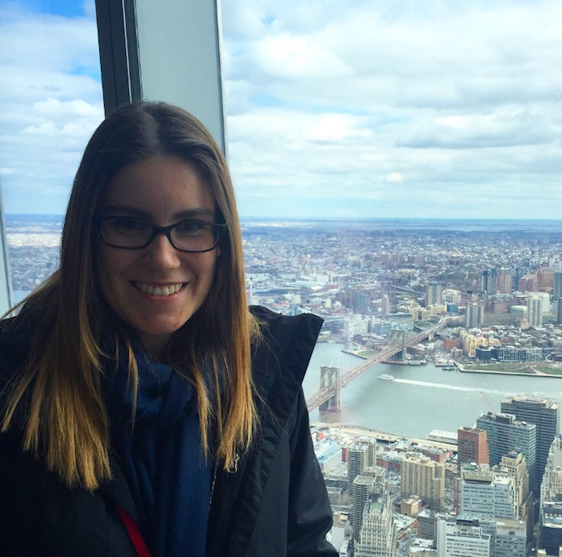

The DIY Rotating Tank team is composed of faculty, researchers, and students from the University of California, Los Angeles

# **Core Contributors**  

| ------------- |:-------------:|
| | **Spencer Hill** (Postdoc, UCLA Dept. of Atmospheric and Oceanic Sciences) Along with Juan, Spencer is co-leading the overall DIYnamics project.  He loves using rotating tanks to teach core science concepts, and his dream is to put a DIYnamics rotating tank kit in every science classroom in the country. [Link to webpage](http://people.atmos.ucla.edu/shill/)|
| | **Juan Lora** (Postdoc, UCLA Dept. of Earth, Planetary, and Space Sciences) Along with Spencer, Juan is co-leading the overall DIYnamics project. He is interested in using science demos to illustrate abstract physical phenomena in tangible and exciting ways, and to bring the joy of science to non-scientists and students of all backgrounds (and maybe help inspire a few future scientists). [Link to webpage](http://staff.epss.ucla.edu/~jlora/index.html)|
| | **Sean Faulk** (Graduate student, UCLA Department of Earth, Planetary, and Space Sciences) Sean helped write the lab instructions and organize the first outreach trips for the DIYnamics project. He studies climates on other planets and loves going out to schools to play with rotating tanks and help students learn about planetary atmospheres!|
| | **Jonathan Aurnou** (Professor, UCLA Dept. of Earth, Planetary, and Space Sciences) Jonathan considers few things as satisfying as developing inexpensive, portable rotating tables for teaching core geoscience topics.  Thus, he is so pleased to be a part of the DIYnamics project. [Link to webpage](http://epss.ucla.edu/people/faculty/543/)|
| | **Norris Khoo** (Undergraduate, UCLA Class of 2018 - Paleobiology) Norris designed the DIY Rotating Tank and wrote its PDF instructions. He created the outreach project website and instructional videos with the help of Spencer Hill. |
| | **Raul Reyes** (Undergraduate, UCLA Dept. of Earth, Planetary, and Space Sciences) Raul created the [baroclinic eddies](https://www.youtube.com/watch?v=2nACitkIqNs) video under Juan's guidance. |
| | **Jonathan Mitchell** |
| | **Helen Parish** |

# **Outreach Event Volunteers**  

| ------------- |:-------------:|
| | **Ashley Shoenfeld** (Graduate student, UCLA Dept. of Earth, Planetary, and Space Sciences) Ashley is currently studying the ice moons of Jupiter and Saturn, and is a volunteer for the DIYnamics project. She believes outreach is one of the most important aspects of being a scientist, and genuinely loves teaching. She is passionate about science and hope she can impart that passion onto others.|
| | **Alex Arnold** |
| | **Chloe Whicker** |
| | **Katie Tuite** |
| | **Ellen Hoppe** |
